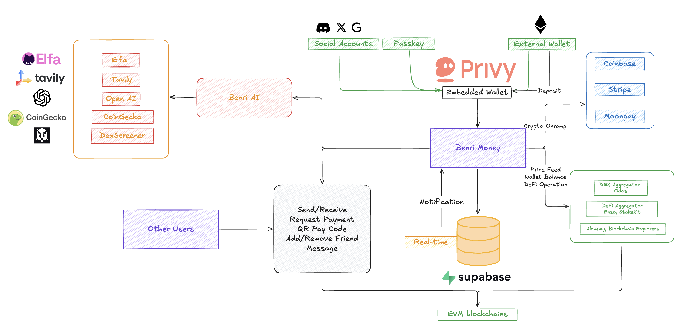

# [Benri Money](https://benri-money.vercel.app) - Web3 Payment and wallet management at ease

Benri Money is a Web2 friendly, venmo-style payment app embedded with an intelligent Web3 assistant that helps users with daily cryptocurrency transactions, P2P payments, market insights, and social intelligence. It provides a seamless interface for interacting with blockchain networks and accessing real-time crypto market data.

#### Website
https://benri-money.vercel.app

## Features

### 1. Token Transfers
- Send tokens (ETH, USDC, WETH, WBTC) across multiple networks (Base, Ethereum, Polygon)
- User-friendly transactions using usernames or email addresses
- Built-in transaction validation and security checks
- Real-time transaction status updates

### 2. Market Analysis
- Real-time token price tracking
- Detailed market data including:
  - Price changes
  - Trading volume
  - Liquidity metrics
  - Buy/sell activity

### 3. Social Intelligence
- Twitter sentiment analysis for crypto topics
- Trending token tracking across multiple timeframes (4h, 24h, 3d, 7d)
- Twitter account smart stats
- Token mention monitoring and analysis

### 4. DeFi Features
- Token swapping functionality
- Staking capabilities
- Real-time price quotes
- Transaction assembly and execution

## Technology Stack

- **Frontend**: Next.js, React, TypeScript
- **UI Components**: Shadcn/UI, Material-UI
- **Web3**: Viem, Privy
- **Authentication**: Privy Auth
- **State Management**: Custom stores
- **Animation**: Framer Motion
- **Data Fetching**: REST APIs
- **Database**: Supabase
- **Styling**: Tailwind CSS

## Core Components

### Payment Components
- Web2 friendly on-ramp integration
- P2P payment interface
- Transaction history
- Payment request and receive
- Payment notification
- Messaging services

### AI Chat Interface
- Real-time AI interactions
- Tool-based action execution
- Suggested actions for common tasks
- Transaction card rendering
- Markdown support for responses

### DeFi Components
- Swap Card for token exchanges
- Staking Card for yield opportunities
- Transaction assembly and execution
- Network switching support

## Security Features

- Transaction validation
- Chain ID verification
- Address validation
- Error handling and recovery
- User authentication
- Secure wallet connections

## Getting Started

1. Clone the repository
2. Install dependencies:

```bash
pnpm i
```

3. Set up environment variables:

```bash
cp .env.template .env.local
```

4. Run the development server:

```bash
pnpm dev
```

5. Open your browser and navigate to `http://localhost:3000` to access the application.


## Architecture

The application follows a modular architecture with:
- Component-based UI design
- Tool-based AI interaction system
- Store-based state management
- Service-based external integrations

## API Integration

The project integrates with multiple APIs:
- Privy for authentication, user management and wallet connections
- Odos for swap functionality
- StakeKit for DeFi staking features
- Custom APIs for transaction handling
- Elfa AI for social media analysis
- Gecko & Dexscreener for price tracking
- Tavily for search and content retrieval

## Arichitecture Diagram


